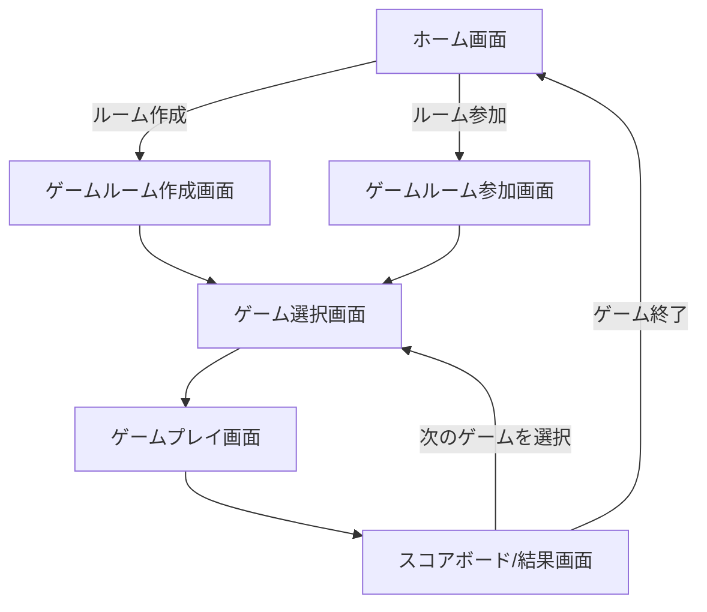

# ウミガメスープの思考レストラン

## 画面構成

```mermaid
graph TD
    A[ホーム画面] -->|ルーム作成| B[ゲームルーム作成画面]
    A -->|ルーム参加| C[ゲームルーム参加画面]
    B --> D[ゲーム選択画面]
    C --> D
    D --> E[ゲームプレイ画面]
    E --> F[スコアボード/結果画面]
    F -->|次のゲームを選択| D
    F -->|ゲーム終了| A
```
